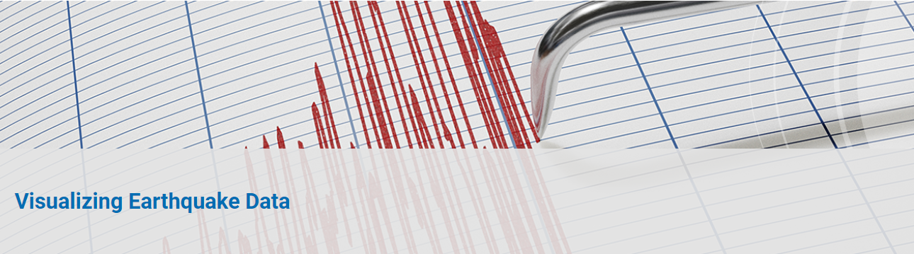
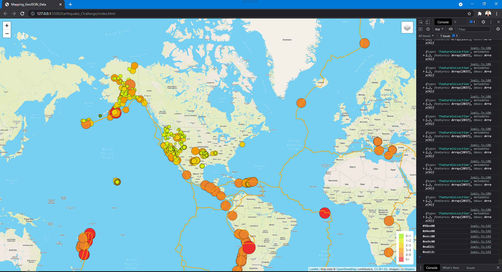
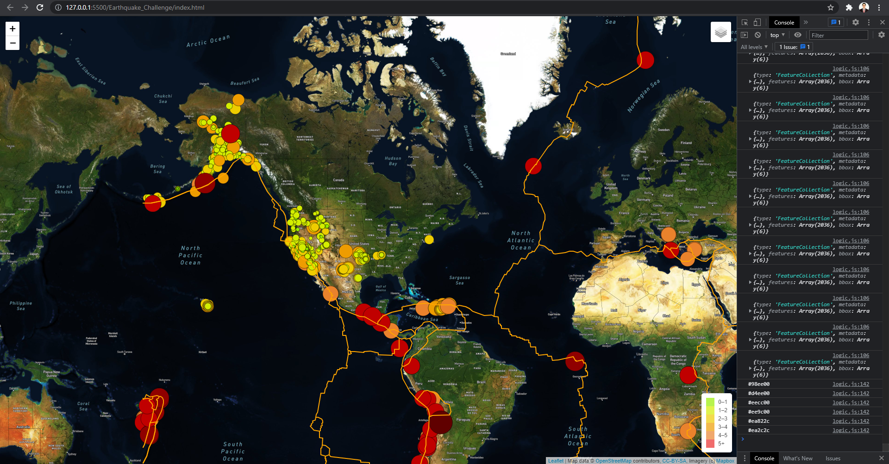
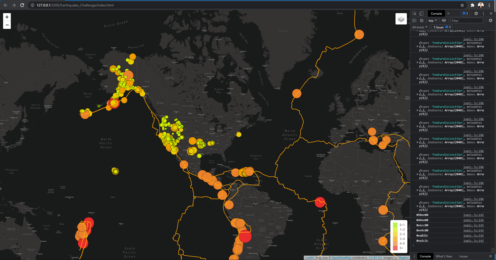

# Mapping_Earthquakes

## Background
Basil and Sadhana like how you created your earthquake map with two different maps and the earthquake overlay. Now, Basil and Sadhana would like to see the earthquake data in relation to the tectonic plates’ location on the earth, and they would like to see all the earthquakes with a magnitude greater than 4.5 on the map, and they would like to see the data on a third map.

This new assignment consists of three technical analysis deliverables. You will submit the following:

https://dalejandri.github.io/Mapping_Earthquakes/blob/main/Earthquake_Challenge/index.html

## Deliverable 1: Add Tectonic Plate Data

- Deliverable 1 Instructions

Using your knowledge of JavaScript, Leaflet.js, and geoJSON data, you’ll add tectonic plate data using d3.json(), add the data using the geoJSON() layer, set the tectonic plate LineString data to stand out on the map, and add the tectonic plate data to the overlay object with the earthquake data.

## Deliverable 2: Add Major Earthquake Data

- Deliverable 2 Instructions

Using your knowledge of JavaScript, Leaflet.js, and geoJSON data, you’ll add major earthquake data to the map using d3.json(), and a color and set the radius of the circle based on the magnitude of earthquake, and add a popup marker for each earthquake that displays the magnitude and location of the earthquake using the GeoJSON layer, geoJSON().

## Deliverable 3: Add an Additional Map

- Deliverable 3 Instructions

Using your knowledge of JavaScript and Leaflet.js add a third map style to your earthquake map.

